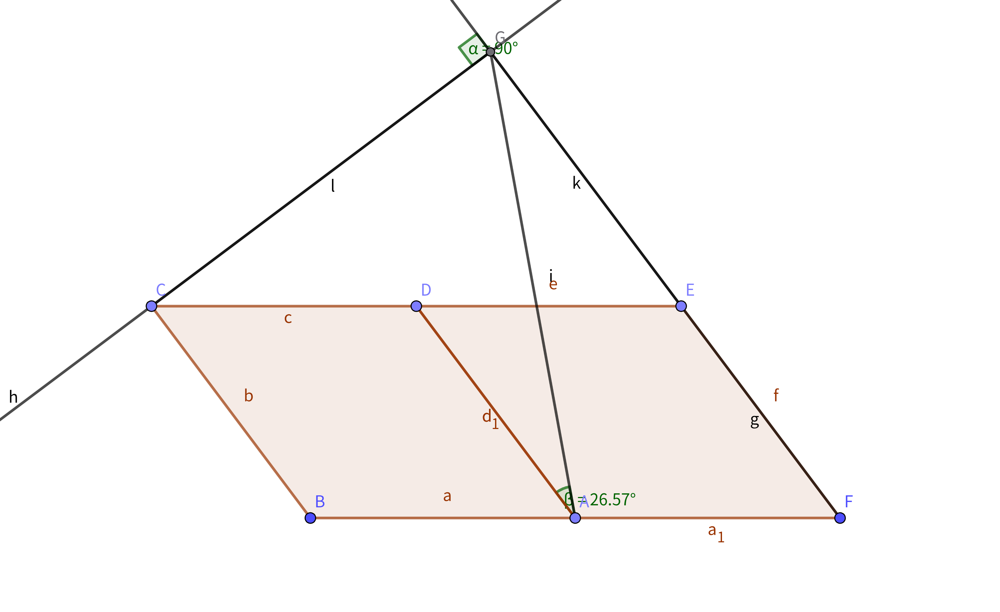



### 【検定過去問の技能別対策】

◆作図

・ものさしやコンパスで作図する場合
↑頂点記号の指定に従って必要な線と不要な線の区別に注意する

◆整理

・アルファベット順で隣り合わないように図形の頂点へ記号をあてはめる場合
↑各記号が線分で結べる頂点の数から位置を決める

・［極端に離れた値の前提を持つ問題］で重複を許す複数の正の整数の平均値から最大値を求める場合
↑最大値以外をすべて1とする

### 【応用問題】

◆式の展開と因数分解

・式の展開によって特定次数の項の係数を求める場合
↑該当する乗算結果の部分のみ展開して係数のみ加算すればよい

・括弧が4組以上の式の展開をする場合
↑途中で因数分解の工夫が活用しやすい組み合わせで計算する

&#9888;&#65039;因数分解する場合
→→まず共通因数をくくりだし括弧内を因数分解する

&#9888;&#65039;括弧の中身が3項以上の場合
→→3つの数の最大公約数を共通因数とする

&#9888;&#65039;置き換えをつかって因数分解する場合
→→置換対象は係数を含めてであり項数2以上の式も可能

&#9888;&#65039;数の計算を工夫する場合
→→乗算の公式を用いればよい

◆平方根

・循環小数を分数に直す場合
↑小数部分のみ循環している形を作るために［循環開始部分まで10の累乗した式］と［10の累乗して循環桁乗した式］で連立方程式をつくって解く

・平方根の不等式を満たすnを求める場合
↑すべてを2乗してルートを外して解く

・ルートの中身が文字nを含む積で結果が2桁の自然数となるような整数nを求める場合
↑素因数分解して条件を作りそれを満たすnを探す

・ルートの中身が文字nを含む差で結果が整数となるような自然数nを求める場合
↑整数には0も含まれることに着目して必要なら偶奇の加減で絞り込む

・平方根の整数部分と小数部分に分けて計算する場合
↑［n<●<n+1］この条件式を満たすnを整数部分として求める

・平方根の小数部分を変数とした式を解く場合
↑平方根の係数をルートの中身に戻して整数部分を見分けやすくする

・ある座標上の斜めの線分の長さを求める場合
↑線分を1辺とする正方形を描き座標から面積を見積もって平方根を求める

・分母に文字を含む分数の平方根が整数か調べる場合
↑有理化をせずに分母のルートの中身と分子から条件を照合する

◆2次方程式

・長方形の土地を通る複数の道路を除いた面積を求める場合
↑複数の道路を長方形の端に平行移動して計算する

・座標平面での図形に関する文章題でx座標をpとして解く場合
↑座標の象限からpの正負条件を見定める

&#9888;&#65039;ある2次方程式を因数分解して(?-x)(?-x)の形になった場合
→→交換法則と等式の両辺の関係性から括弧内を(x-?)(x-?)の形に変形できる

◆2乗に比例する関数

・軸で線対称な放物線2つの線上に頂点を4つ持ち中点が一方の軸になる正方形の1辺の長さを求める場合
↑軸をまたぐ交点の距離は絶対値の和であることに注意する

・2乗に比例する関数から秒間の平均の速度を求める場合
↑関数の変化の割合を求めることに等しい

&#9888;&#65039;放物線と直線の交点を変化の割合の観点で見た場合
→→放物線の変化の割合は2点を結ぶ直線の傾きを示す

◆相似

・台形の対角線の交点を通る底辺に平行な直線の長さを求める場合
↑対角線から作る2組の相似な三角形の平行線にあたる長さを求めて合算する
↑直線が対角線の中点を通る場合は中点連結定理をつかう

・平行四辺形の1辺の線分比によりずれた対角線で隣接する三角形の面積比を求める場合
↑相似な三角形の線分比が隣接する三角形の面積比になる

・ある図形の相似比や面積比から対象となる三角形の面積比を求める場合
↑面積比の加減で単位なしの面積を扱う

・三角形の底辺両端の角の二等分線の交点を通り底辺に平行な直線の長さを求める場合
↑錯角は等しいので二等辺三角形となり相似な三角形の周の長さの比をつかう

・台形の底辺に平行な面積を等分する線分の長さを求める場合
↑延長線から三角形の面積比を出して相似比を明らかにする

・角度が与えられている相似な三角形を含む図形のある線分の長さを求める場合
↑角度に関連する相似な三角形を導き出してつかう

・円錐台の体積比を求める場合
↑延長線から円錐を作り三角形と比の定理から相似比や面積比を明らかにする

&#9888;&#65039;相似な三角形がすぐに見つからない場合
→→補助線を使い交点との線分比を出す

&#9888;&#65039;平行線と比の定理をつかう場合
→→対頂角から相似の定義を用いる方法も併用する
→→交わる直線を平行移動すれば三角形と比の定理も扱える

&#9888;&#65039;相似な三角形の組が2つあり片方が重複する場合
→→最小公倍数をつかって3つの三角形の面積比を求められる

◆三平方の定理

・高さの分からない等脚台形の面積を求める場合
↑上底と下底以外の1辺の平行線を上底か下底の短い方の頂点に合わせて補助線を引き平行四辺形を作ることで二等辺三角形が生じるので高さが分かる

・三辺の長さが分かっている三角形の面積を求める場合
↑三平方の定理を利用して方程式をつくり高さを明らかにする

・座標平面上の点と直線の距離を求める場合
↑［点のx座標とy座標を直線の式に代入して得られる三角形の面積］=［三平方の定理で求めた三角形の面積］

・ある2点と直線の最短経路の長さを求める場合
↑最短経路の作図方法を応用して経路を形作る交点を出し三平方の定理で距離を求める

・座標平面上の直線を通る1辺を持つ正三角形の1辺の長さを求める場合
↑［直線上の辺を底辺とする三角形の面積比］より［高さの等しい三角形から高さを求める］そして特別な三角形の性質をつかう

・長方形を対角線で折り返した交点から頂点までの長さを求める場合
↑折り返して重なる部分について二等辺三角形になることから三平方の定理をつかう

・共通接線の両側に円があり各接点を両端とする線分の長さを求める場合
↑どちらかの円の中心を通る接線に平行な直線を引き長方形をつくり半径と中心間の距離をつかう

・側面が正三角形の正四角錐の側面1辺の中点から頂点までの最短距離を求める場合
↑補助線で延長線を引けば特別な三角形が現れる

・円錐の底面の直径を担う点から反対側もしくは母線上の点までの最短距離を求める場合
↑弦と母線から特別な三角形の性質をつかう

・座標上で原点を中心に回転移動した図形の通った部分の面積を求める場合
↑三平方の定理と点と直線の距離が垂線の長さであることをつかう

&#9888;&#65039;平面上で重複部分のある2つの図形がどの高さでお互い干渉しなくなるか調べる場合
→→各図形の高さに該当する部分の長さを半径とする円をそれぞれ描き円周の交点を求める

◆円周角と接線

・円周の内外にある点と円周上の点を結ぶ線分の長さを求める場合
↑補助線で円周角の定理を使い相似な三角形をつくる

・弧の長さが等しい円周上の点のある線分の長さを求める場合
↑円周角を利用して二等辺三角形や合同および相似を駆使する

・ある2点からの成す角が45度になる点を直線上に作図する場合
↑［2点を結ぶ線分を直径とする円］［垂直二等分線］→［これらの交点を中心とする円］［直線］→これらの交点を探す
＊中心角90度から導ける

・円周上に直径を1辺とする鋭角15度の三角形を作図する場合
↑［中心角が辺上90度］［正三角形60度］→［角の二等分線30度］→［中心角に対する円周角15度］

&#9888;&#65039;ある2点の垂直二等分線と直線の距離関係を見る場合
→→垂直二等分線をy軸とすれば直線の傾きによらず各点からの距離はx軸方向に依存する

◆標本調査

・通学時間を調べる場合
↑最寄り駅で標本を集めると電車通学も含まれるため通勤方法を分類する必要がある

・世論調査を行う場合
↑調査時間帯を限定すると標本にかたよりが出るので限定せず各個人に対し設定した数量まで調査をかける

◆実践例題

・［ひし形が横に2つ並ぶ図形の鋭角］より［対辺の延長線に垂線を引いた交点］から［［図形の中点まで引いた線分］と［ひし形の辺］が成す角］から［元のひし形の鋭角］を求める場合
↑延長線と垂線は直角に交わり図形の横の辺が円の直径だから二等辺三角形と平行線の定義をつかう

＊参考画像

  
  {: width="300"}
  

・大小の円の面積差が分かっているとき小さい円の接線と大きい円との交点を両端とする線分の長さを求める場合
↑［大小の半径から出てくる直角三角形］から三平方の定理で求めた式に［面積差の式］を代入する

・［下凸放物線上の点Aと点B］が［グラフ外の直角で交わる点］から［各点までの距離が等しいこと］から点Aと点Bの座標を求める場合
↑各点を変数で表し［変化の割合が-1であること］と［交点までの距離が等しいこと］から連立方程式を解く

◆中学総合問題

・［下凸放物線］［x軸//線］の［交点B(x>0)とx軸上の点Pを結ぶ底辺BP］が［交点Aを頂点として作る△］［原点Oと点Aを結ぶ線分AO上の点Rを頂点として作る△］の面積が等しくなるような［x軸//線］の式を求める場合
↑［底辺BPが&#9649;の1辺］［線分AOがその対辺］［線分POも&#9649;の1辺］［対辺BAの半分の長さ］が［点Aと点Bのx座標］に対応する

・ある円と円の外の2点が円周上の点において成す角90度になるように作図する場合
↑円周角の定理より［2点を直径とする円］と［ある円］との交点において成す角90度になる

・表に自然数を奇数行では左から右へ偶数行では逆順に並べる状況を文字式にする場合
↑行数mでn番目の自然数として奇数行は10(m-1)+nで偶数行は10m+1-nとなる

・正四面体の1辺とねじれの辺上の点を通る切断面の面積を求める場合
↑特別な三角形の性質から［ねじれの辺上の点の底面からの高さ］を求めることで三平方の定理で［切断面の1辺の長さ］が分かり二等辺三角形であることから面積が求まる

・正四面体の1辺とねじれの辺上の点を通る切断面から頂点までの垂線の長さを求める場合
↑［ねじれ辺を底辺とする△の高さは一定］→［ねじれ辺の線分比が面積比］→［この△を底面とする三角錐の高さは一定］→［面積比が体積比］→［正四面体全体の体積と体積比］から垂線の長さを求める
＊三角形と比の定理より切断面が底面と平行でない分だけ計算に使う正四面体の高さは長くなる
＊相似の面積比や体積比と混同しないよう注意する

・ある2点と交わらない直線から成す角30度の平行四辺形を作図する場合
↑2点を結ぶ線分を1辺とする正三角形の他頂点を中心とする円と直線の交点を描く

・下凸放物線と直線とy軸が作り出す三角形の関係性を見る場合
↑［放物線と直線の交点のx座標］から各式を求め［三角形の等積変形と面積比］の関係から高さの比をつかう

・立体の頂点1点を通る平行四辺形状の移動切断面が作り出す立体の体積を求める場合
↑切断面の移動方向に頂点1点と対辺を通る面で分割して公式が適用できる形にする

・［立体の頂点を始点とする動点2点］の［動点のない方向の辺の中点］の［軌跡が描く面積］を求める場合
↑中点連結定理で各線分の長さを出し平面図から中点軌跡部分に相当する面積を求める
